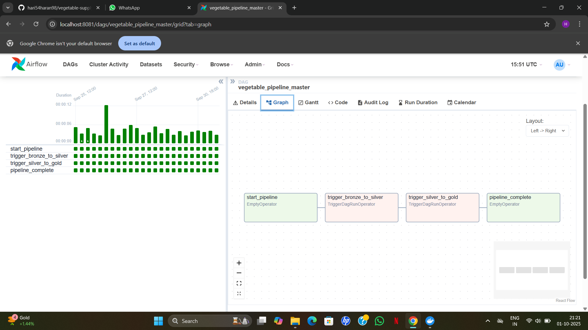
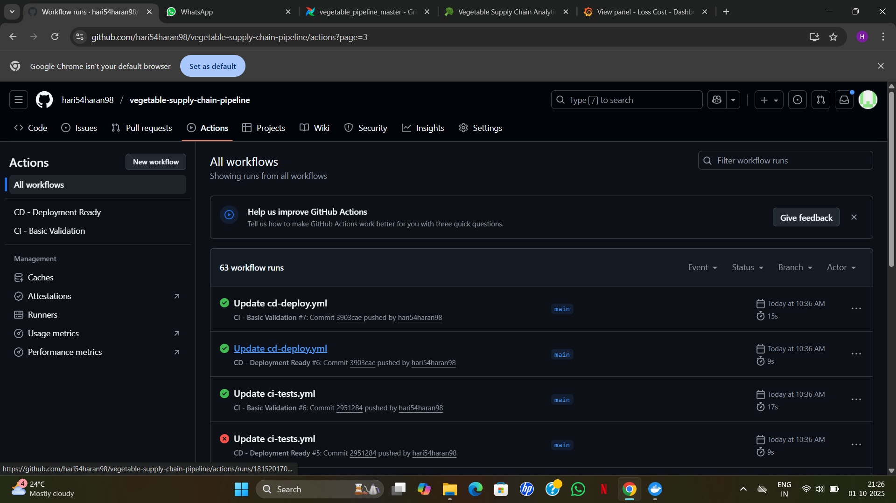

# 🥦 Vegetable Supply Chain Data Pipeline

An **end-to-end production-grade Data Engineering project** that simulates a real-world vegetable supply chain.  
Built entirely on **Dockerized microservices** with **CI/CD, orchestration, monitoring, and business insights**.  

This project proves readiness for **real data engineering roles** by combining ingestion, processing, ML, dashboards, monitoring, and DevOps best practices.

---

## 🚀 Project Architecture

### 1. Data Ingestion
- **Source**: CSV files with vegetable prices & wastage data
- **Technology**: Kafka Producers & Consumers (Python)
- **Bronze Layer**: Raw immutable data in PostgreSQL warehouse

### 2. Data Processing – Medallion Architecture
- **Bronze → Silver**: Cleaning, validation & enrichment  
- **Silver → Gold**: Business metrics + ML model for wastage prediction  
- **Database**: PostgreSQL (acts as warehouse)

### 3. Orchestration & Automation
- **Apache Airflow DAGs** schedule & manage ETL jobs:  
  - `bronze_to_silver_transformation`  
  - `silver_to_gold_transformation`  
  - `vegetable_pipeline_master`

### 4. Business Intelligence
- **Streamlit** → interactive dashboards for daily analysis  
- **Grafana + Prometheus** → executive dashboards with real-time KPIs  

### 5. DevOps & CI/CD
- **Docker** → every service containerized (Kafka, Airflow, Postgres, Streamlit, Grafana, Prometheus)  
- **Single Docker Network** → all services communicate seamlessly  
- **GitHub Actions CI/CD** → automated testing & deployment for business metrics  

---

## 📊 Tech Stack

- **Languages**: Python, SQL, PySpark  
- **Streaming**: Apache Kafka  
- **Warehouse**: PostgreSQL  
- **Orchestration**: Apache Airflow  
- **Visualization**: Streamlit, Grafana  
- **Monitoring**: Prometheus  
- **DevOps**: Docker, Docker Compose, GitHub Actions  

---

## 🐳 Dockerized Architecture

- Each component runs in its own container:  
  - `jupyter` – experimentation & CSV preprocessing  
  - `kafka` & `zookeeper` – streaming backbone  
  - `postgres` – warehouse  
  - `airflow-webserver`, `airflow-scheduler` – orchestration  
  - `streamlit-app` – business dashboard  
  - `grafana`, `prometheus` – monitoring & alerting  

- **Infrastructure-as-Code**:  
  - `docker-compose.core.yml` → core stack  
  - `docker-compose.airflow.yml` → orchestration  
  - `docker-compose.streamlit.yml` → BI  
  - `docker-compose.monitoring.yml` → monitoring  
  - `prometheus.yml` → Prometheus config  

---
## 📌 Skills Demonstrated

- **Data Engineering**: Kafka (streaming), PostgreSQL (warehouse), Medallion Architecture (Bronze → Silver → Gold)
- **Orchestration**: Apache Airflow DAGs for ETL automation
- **Business Intelligence**: Streamlit dashboards for operational insights
- **Monitoring**: Grafana + Prometheus for system + business metrics
- **DevOps**: Docker, Docker Compose, GitHub Actions CI/CD
- **Programming**: Python, SQL, PySpark
- **Machine Learning**: Basic ML model integrated into Gold layer
- 
## 📸 Screenshots

### Airflow – Orchestration


### Streamlit – Business Dashboards
.png)  
.png)  
.png)

### Monitoring – Grafana & Prometheus
.png)  
.png)  
.png)

### GitHub CI/CD


---

## ✅ Key Features

- **Real-time ingestion** → Kafka → Bronze  
- **Data cleaning & enrichment** → Silver  
- **Business metrics + ML** → Gold  
- **End-to-end orchestration** → Airflow DAGs  
- **Executive insights** → Streamlit + Grafana  
- **Monitoring & Alerts** → Prometheus  
- **CI/CD** → automated validation & deployment with GitHub Actions  
- **100% Dockerized** → consistent, production-like environment  

---

## 🚀 Business Metrics Monitoring CI/CD

Automated **CI/CD pipeline for business metrics** in the vegetable supply chain.

### 📊 Metrics Monitored
- Bronze, Silver, Gold layer row counts  
- Average wastage percentage  
- Total avoidable loss cost (INR)  
- Top vegetables by wastage  

### 🚀 CI/CD Pipeline
**Continuous Integration (CI)**  
- Automatic testing on every push  
- Business logic validation  
- Database connectivity tests  

**Continuous Deployment (CD)**  
- Automatic deployment to production  
- Zero-downtime updates  
- Health verification  

### 🛠️ Setup
```bash
# Install dependencies
pip install -r requirements.txt

# Run tests
pytest tests/ -v

# Start core services (Kafka, Postgres, Jupyter)
docker-compose -f docker-compose.core.yml up -d

# Start Airflow
docker-compose -f docker-compose.airflow.yml up -d

# Start Streamlit Dashboard
docker-compose -f docker-compose.streamlit.yml up -d

# Start Monitoring Stack
docker-compose -f docker-compose.monitoring.yml up -d


